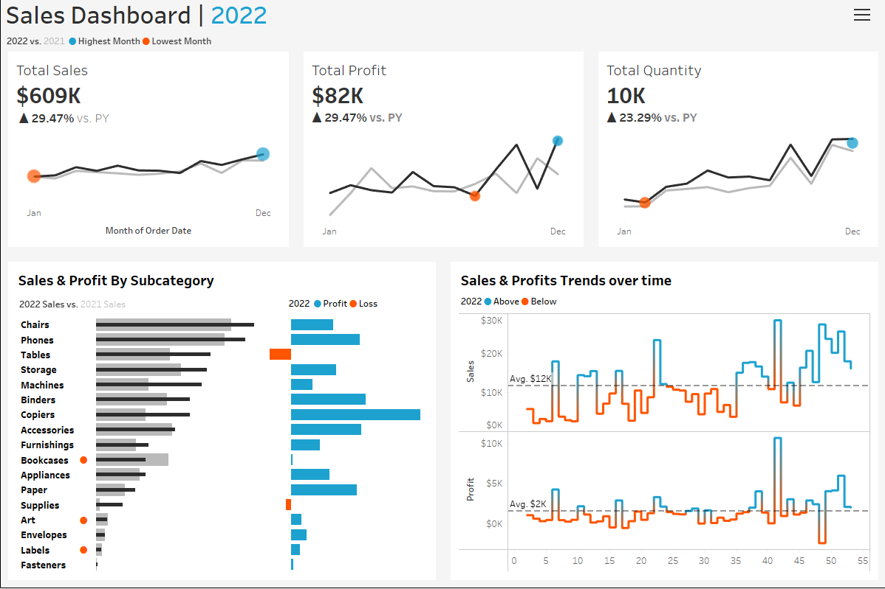

# 📊 Sales Performance Dashboard – Tableau Project
Author: Khant Min Thaw
Project Type: Beginner Tableau Dashboard
Status: Completed

## 🧭 Overview
This project marks my first venture into Tableau. The primary objective was to construct a dynamic sales dashboard that offers insights into key performance indicators (KPIs), trends, and comparative analyses over time. This hands-on experience aimed to solidify my understanding of Tableau's core functionalities and best practices in data visualization.

## 📌 Project Objectives
- Data Connection: Import and manage data from Excel sources.
- KPI Visualization: Create visual representations for Total Sales, Total Profit, and Total Quantity.
- Trend Analysis: Develop line charts to depict monthly trends and year-over-year comparisons.
- Highlight Extremes: Identify and mark peak and trough months using color-coded indicators 
- Interactive Dashboard: Assemble an interactive dashboard with filters for enhanced user engagement.

## 🛠️ Tools & Technologies
- Tableau Desktop 2023.2
- Microsoft Excel for data preparation

## 📈 Dashboard Features
KPI Cards: Displaying Total Sales, Total Profit, and Total Quantity.
Monthly Trends: Line charts illustrating monthly performance with year-over-year comparisons.
Peak & Trough Indicators: Colored markers highlighting highest and lowest performing months.
Interactive Filters: Allowing users to filter data by categories such as region or product type.

## 🧠 Learnings & Reflections
This project provided a strong foundation in Tableau and helped me understand what goes into building effective visualizations. Key takeaways include:

- **Calculated Fields**: I learned how to create and apply calculated fields to transform raw data into meaningful metrics and KPIs. This was essential for building dynamic visuals like monthly trends and performance indicators.
- **Designing Clean Visuals**: I gained experience in designing dashboards that are both clean and visually appealing. Keeping layouts organized and using appropriate color cues helped improve readability and user experience.
- **Audience-Centered Thinking**: One of the most important lessons was understanding what stakeholders or viewers actually need to see. I learned how to tailor the dashboard to highlight the most relevant insights for the end user—whether that’s sales trends, profit breakdowns, or performance comparisons.

This experience has deepened my appreciation for the balance between technical data work and thoughtful design, which is crucial in real-world data visualization projects.

📸 Dashboard Preview

